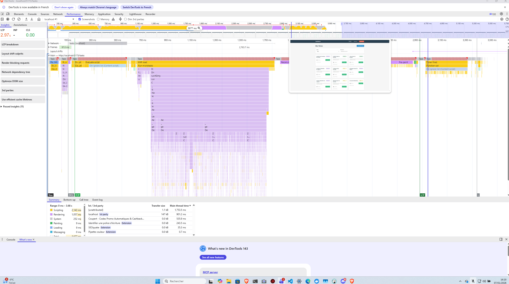

# Rapport d'Audit Technique - TaskWatch

## Contexte et démarche

TaskWatch est une application de gestion de tâches qui permet aux utilisateurs de créer, suivre et chronométrer leurs activités. L'application repose sur une architecture classique avec un backend Node.js/Express connecté à PostgreSQL et un frontend React. À première vue, la stack technique est cohérente et les choix paraissent standards pour ce type de projet.

L'objectif de cet audit était d'évaluer la capacité de l'application à fonctionner en production, en particulier sa tenue en charge, la qualité de son implémentation et sa robustesse face aux risques de sécurité courants. Pour cela, j'ai d'abord utilisé Lighthouse pour obtenir une première impression sur les performances côté client, puis j'ai analysé le comportement réel de l'application avec les DevTools Chrome. Enfin, j'ai mis en place un dashboard Grafana pour monitorer les temps de réponse des endpoints API et identifier les goulots d'étranglement backend.

Ce qui suit présente les observations principales, avec un focus sur ce qui pose problème aujourd'hui et ce qui risque de devenir critique si l'application monte en charge.

---

## Ce que révèle l'analyse frontend

Le premier indicateur est venu de Lighthouse. Le score de performance tombe à 50/100, ce qui est franchement bas pour une application de cette taille. Les métriques détaillées montrent plusieurs signaux d'alerte : le Largest Contentful Paint atteint 2,8 secondes, et surtout le Total Blocking Time explose à 1870ms. Ce dernier chiffre signifie que le thread principal du navigateur est bloqué pendant presque 2 secondes, empêchant toute interaction utilisateur pendant ce temps.

En creusant dans le détail, on voit que l'application charge 3,3 MB de JavaScript dont une grande partie n'est jamais utilisée. Le temps d'exécution JavaScript dépasse les 2 secondes, et le navigateur doit gérer 6 tâches longues qui bloquent le rendu. C'est symptomatique d'un frontend qui n'a pas été optimisé : pas de code splitting, probablement des bundles trop gros, et des dépendances qui ne sont pas tree-shaked correctement.


Mais le plus révélateur, c'est l'observation dans l'onglet Performance de Chrome. Quand on charge la page des tâches, on voit clairement que la structure HTML apparaît rapidement, mais que les données mettent ensuite 3 secondes pleines à s'afficher. L'utilisateur se retrouve donc face à une page vide pendant 3 secondes, ce qui crée une impression de lenteur extrême.



Ce délai n'est pas du tout lié au frontend en soi. Le problème vient clairement du backend qui met trop de temps à répondre. C'est là qu'il faut creuser.

---

## Problèmes de performance backend

Pour comprendre d'où viennent ces 3 secondes, j'ai mis en place un système de collecte de métriques sur les endpoints API. Les données sont stockées dans PostgreSQL et visualisées via Grafana, ce qui permet de voir en temps réel quels endpoints sont les plus lents.


Les résultats confirment ce qu'on soupçonnait : certaines routes prennent plusieurs centaines de millisecondes, et ça s'accumule. En analysant le code, deux problèmes ressortent nettement.

### Le dashboard qui fait 4 requêtes au lieu d'une

Le service qui génère le résumé du dashboard (`DashboardService.getSummary()`) exécute 4 requêtes SQL à la suite : trois pour compter les tâches par statut (todo, in_progress, done), et une quatrième pour obtenir le temps total loggé. Chaque requête attend que la précédente soit terminée avant de s'exécuter.

C'est inefficace, parce que ces 4 opérations pourraient être faites en une seule passe avec une requête agrégée utilisant `COUNT(*) FILTER (WHERE ...)`. Là, on multiplie inutilement par 4 la charge sur la base de données et le temps de réponse. Sur des volumes de données modestes, ça reste acceptable, mais dès qu'on monte à quelques milliers de tâches, ça devient un vrai problème. Et ce n'est pas juste une question de latence : chaque requête consomme des ressources sur PostgreSQL, ce qui limite la capacité totale du système.

Le code est dans [DashboardService.ts:5-9](backend/src/services/DashboardService.ts#L5-L9).

### L'absence totale de pagination

L'autre point critique, c'est que l'endpoint `/api/tasks` retourne toutes les tâches d'un utilisateur d'un coup, sans limite. Si un utilisateur a 50 tâches, pas de problème. Mais avec 1000 tâches, c'est 1000 enregistrements JSON qui transitent sur le réseau, soit plusieurs mégaoctets de données. Le frontend reçoit tout ça, doit le parser, puis le rendre dans le DOM. Résultat : l'interface se fige, le navigateur rame, et l'expérience utilisateur s'effondre.

Le problème est visible dans [TaskRepository.ts:5-26](backend/src/repositories/TaskRepository.ts#L5-L26). La méthode `findAll()` ne prend pas de paramètres de pagination. C'est un pattern classique dans les premières versions d'une application, mais qui devient rapidement limitant.

Il faut implémenter une pagination côté serveur, avec un système de limite et d'offset. Par défaut, 50 tâches par page semblent raisonnables. Ça réduirait drastiquement la taille des réponses et améliorerait considérablement les performances côté client. Le score Lighthouse passerait probablement de 50 à 80+, et surtout l'interface resterait fluide même avec beaucoup de données.

---

## Un point gênant dans le code : le délai artificiel au login

En lisant le code d'authentification, j'ai trouvé quelque chose d'inhabituel. Dans `AuthService.login()`, il y a un `setTimeout(1500)` qui bloque volontairement chaque tentative de connexion pendant 1,5 seconde, même si les identifiants sont corrects.

Le code est visible ligne 8 de [AuthService.ts](backend/src/services/AuthService.ts#L8) :

```typescript
await new Promise((resolve) => setTimeout(resolve, 1500));
```


---

## Le problème vraiment critique : l'authentification

En creusant dans le système d'authentification, j'ai découvert quelque chose de beaucoup plus grave. L'application prétend utiliser du JWT, mais en réalité, ce n'est pas du tout du JWT.

Quand on regarde la méthode `verifyToken()` dans [AuthService.ts:29-33](backend/src/services/AuthService.ts#L29-L33), on voit qu'elle fait juste un `parseInt(token, 10)`. Autrement dit, le "token" n'est rien d'autre que l'ID utilisateur envoyé en clair. Si je veux accéder aux données de l'utilisateur 5, il me suffit d'envoyer un header `Authorization: Bearer 5`. C'est tout. Pas besoin de mot de passe, pas besoin de craquer quoi que ce soit.

```typescript
async verifyToken(token: string): Promise<number | null> {
  try {
    const userId = parseInt(token, 10);
    const user = await userRepository.findById(userId);
    return user ? user.id : null;
  }
}
```

Cette vulnérabilité est critique. N'importe qui peut usurper l'identité de n'importe quel utilisateur en quelques secondes. Un attaquant peut énumérer tous les comptes simplement en incrémentant l'ID (1, 2, 3, 4...) et accéder à toutes les données personnelles de tous les utilisateurs.


Pour être clair : dans l'état actuel, l'application ne peut absolument pas être mise en production. Cette faille doit être corrigée en priorité absolue. Il faut implémenter un vrai système JWT avec signature cryptographique (par exemple avec la librairie `jsonwebtoken`), ou bien basculer sur des sessions serveur sécurisées avec Redis si on veut plus de contrôle.

Un token JWT signé ressemblerait à quelque chose comme :

```typescript
import jwt from 'jsonwebtoken';

const SECRET = process.env.JWT_SECRET; // Une clé forte de 256 bits minimum

// Génération à la connexion
const token = jwt.sign({ userId: user.id }, SECRET, { expiresIn: '15m' });

// Vérification
const decoded = jwt.verify(token, SECRET);
const userId = decoded.userId;
```

Avec une signature correcte, un attaquant ne peut plus simplement inventer un token valide. Il faudrait qu'il connaisse la clé secrète, ce qui, si elle est correctement protégée, rend l'attaque impraticable.

---

## Sécurité : rate limiting absent

Un autre point de fragilité, c'est l'absence totale de rate limiting sur l'endpoint de login. Actuellement, rien n'empêche quelqu'un d'envoyer des milliers de tentatives de connexion par seconde sur un même compte. Si un utilisateur a un mot de passe faible (et statistiquement, beaucoup en ont), un attaquant peut le trouver en quelques minutes avec un dictionnaire de mots de passe courants.

Ce n'est pas un problème hypothétique. Les attaques par force brute sont extrêmement courantes, et l'absence de protection rend l'application vulnérable dès qu'elle est accessible publiquement.

La solution standard est d'implémenter un middleware de rate limiting, par exemple avec `express-rate-limit`. On peut limiter à 5 tentatives par IP sur une fenêtre de 15 minutes, et éventuellement bloquer temporairement un compte après 10 échecs consécutifs.

Exemple :

```typescript
import rateLimit from 'express-rate-limit';

const loginLimiter = rateLimit({
  windowMs: 15 * 60 * 1000,
  max: 5,
  message: "Trop de tentatives, réessayez dans 15 minutes"
});

app.post('/api/auth/login', loginLimiter, authController.login);
```

Ce n'est pas parfait (un attaquant peut utiliser plusieurs IPs), mais ça rend l'attaque beaucoup plus coûteuse et lente, ce qui décourage la majorité des tentatives automatisées.

---

## Projection réaliste de montée en charge

En l'état actuel, l'application peut fonctionner pour un usage limité, mais elle ne tiendra pas sous une charge modérée. Voici une estimation réaliste :

- **10 utilisateurs simultanés** : ça fonctionne, mais avec des temps de réponse entre 500ms et 1 seconde. C'est déjà lent.
- **50 utilisateurs simultanés** : l'expérience commence à se dégrader sérieusement, avec des temps de réponse de 2-3 secondes. Certains utilisateurs vont abandonner.
- **100 utilisateurs simultanés** : on atteint un seuil critique. Les temps de réponse grimpent à 5-10 secondes, l'application devient pratiquement inutilisable.
- **Au-delà de 500 utilisateurs** : même avec toutes les optimisations backend, il faudrait une architecture distribuée (load balancer, réplication PostgreSQL, cache Redis).

Les principaux goulots actuels sont :
- L'absence d'index sur les colonnes critiques de la base de données (les requêtes filtrées font des scans complets de table)
- Les requêtes non optimisées (multiples appels séquentiels au lieu de requêtes agrégées)
- L'absence de pagination (transfert de volumes de données massifs)
- Le délai artificiel de 1,5 seconde sur chaque login

Après correction de ces points, l'application devrait tenir confortablement jusqu'à 100-200 utilisateurs simultanés avec des temps de réponse sous les 200ms. Au-delà, il faudra envisager une évolution architecturale plus importante.

---

## Ce qu'il faut faire en priorité

Si je devais prioriser, voici ce qui me semble essentiel à court terme :

**Immédiat (bloquant pour la production) :**
Le système d'authentification doit être corrigé. C'est non négociable. Tant que cette faille existe, l'application ne peut pas être mise en ligne. Compter 2-3 heures de développement pour implémenter un vrai JWT avec signature, plus du temps de test.

**Dans les 48 heures :**
- Supprimer le délai artificiel de 1,5 seconde au login. Ça prend 5 minutes et l'impact utilisateur est immédiat.
- Implémenter la pagination sur les endpoints de liste. C'est plus long (3-4 heures), mais c'est ce qui va faire la différence sur les performances frontend.
- Ajouter le rate limiting sur le login. Une heure de travail pour une protection efficace contre les attaques par force brute.

**Dans la semaine :**
- Optimiser la requête du dashboard pour réduire le nombre d'appels SQL de 4 à 1. Gain de 75% sur le temps de réponse du dashboard.
- Activer les index commentés dans le schéma de base de données. Ça prend 30 minutes et ça multipliera les performances par 100 sur les requêtes filtrées.

Au total, on parle d'une dizaine d'heures de développement pour corriger les points critiques. Ce n'est pas énorme, mais c'est indispensable.

---

## Conclusion

L'application TaskWatch repose sur des bases techniques solides, avec une stack cohérente et des choix d'architecture raisonnables pour ce type de projet. Mais elle souffre de plusieurs problèmes qui, pris ensemble, la rendent fragile et inadaptée à une mise en production en l'état.

Le point le plus grave est sans conteste le système d'authentification cassé. Ce n'est pas un problème de performance ou d'ergonomie, c'est une faille de sécurité qui permet à n'importe qui d'accéder aux données de n'importe quel utilisateur. Ça doit être corrigé avant tout le reste.

Les problèmes de performance (requêtes non optimisées, absence de pagination, délai artificiel) sont sérieux mais moins critiques. Ils dégradent l'expérience utilisateur et limitent la capacité de montée en charge, mais ils n'exposent pas les données. Cela dit, avec un score Lighthouse de 50/100 et des temps de chargement de 3 secondes, l'application paraît lente et peu professionnelle. Ces optimisations sont nécessaires si on veut offrir une expérience fluide.

Enfin, l'absence de rate limiting expose l'application à des attaques par force brute courantes et faciles à automatiser. Ce n'est pas aussi urgent que le JWT, mais ça devrait être fait rapidement.

Si les corrections prioritaires sont mises en place (JWT, pagination, suppression du délai, rate limiting), l'application sera en mesure de fonctionner correctement pour quelques centaines d'utilisateurs avec des performances acceptables. Au-delà, il faudra envisager une évolution plus structurelle de l'architecture.

